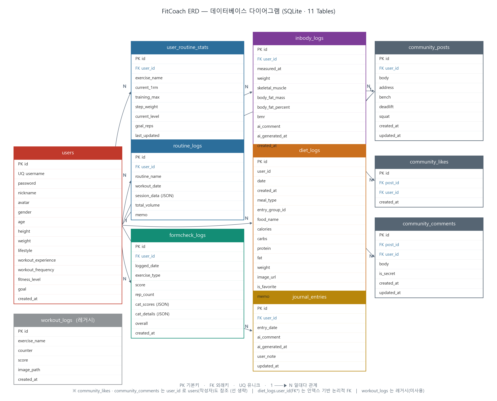

# 데이터베이스 요구사항 분석서 (기능별 DB 접근) — FitCoach

## 0. 사용한 데이터베이스 개요 (어떻게 동작하는가)

- **DBMS** : SQLite (`test.db`) — 별도 서버 없이 **파일 1개로 동작**하는 임베디드 RDB. 백엔드(8001) 프로세스가 직접 파일을 읽고 쓴다.
- **접근 방식** : **SQLAlchemy ORM** — 파이썬 클래스(모델) ↔ 테이블을 매핑하고, `SessionLocal` 세션으로 트랜잭션 단위(commit/rollback) 처리. 요청마다 `get_db()`가 세션을 열고 응답 후 닫는다.
- **스키마 생성** : 서버 기동 시 `Base.metadata.create_all()`로 테이블 자동 생성. 기존 테이블에 누락된 컬럼은 `main.py`의 `ALTER TABLE` 보강 루틴이 1회 추가.
- **공통 규칙** : 모든 테이블 PK는 자동증가 `id`. 대부분 `user_id → users.id` FK로 회원에 종속. 검색이 잦은 컬럼(`user_id`, `date`, `measured_at` 등)에 인덱스.
- **테이블 수** : 총 **11개** (users, user_routine_stats, routine_logs, formcheck_logs, workout_logs(레거시), diet_logs, inbody_logs, journal_entries, community_posts, community_likes, community_comments)

---

## Ⅰ. 기능별 DB 접근 분석

> 각 기능이 **어떤 테이블에 / 어떤 연산으로 접근하여 / 무엇을 하는지** 기술한다. (목록 순서는 사용 흐름 기준)

### ① 회원가입
- **접근 테이블** : `users`
- **동작** : `SELECT`(username 중복 검사) → `INSERT`(신규 행 생성)
- **기능** : 아이디·해시된 비밀번호·신체정보(성별/나이/키/체중)·운동성향·목표·닉네임/아바타를 **한 행으로 저장**한다. 이 행의 `id`가 이후 모든 기록의 소유자 키(`user_id`)가 된다. 비밀번호는 bcrypt 해시 문자열로만 보관한다.

### ② 로그인 / 인증
- **접근 테이블** : `users`
- **동작** : `SELECT`(username으로 1건 조회) → 해시 검증
- **기능** : 비밀번호 해시를 비교해 본인 확인 후 JWT를 발급한다. **토큰 자체는 DB에 저장하지 않고**(stateless), 이후 요청은 토큰의 username으로 `users`를 재조회해 현재 사용자를 식별한다.

### ③ 프로필·신체정보 관리
- **접근 테이블** : `users`
- **동작** : `SELECT` → `UPDATE`
- **기능** : 닉네임·아바타·키·체중·목표 등 기존 회원 행의 값을 수정한다. 변경된 신체정보는 영양 목표(④) 계산의 새 기준이 된다.

### ④ 영양 목표 계산 (BMR·TDEE·매크로)
- **접근 테이블** : `users` (읽기 전용)
- **동작** : `SELECT`
- **기능** : 회원의 성별·나이·키·체중·운동빈도·목표를 읽어 Mifflin-St Jeor 공식으로 BMR→TDEE→목표 칼로리·매크로를 **계산해 화면에 표시**한다. 계산 결과는 별도로 저장하지 않고 매번 산출한다(원본은 `users`에만 존재).

### ⑤ 운동 1RM·증량 상태 관리
- **접근 테이블** : `user_routine_stats`
- **동작** : `SELECT` → `INSERT`/`UPDATE`(UPSERT)
- **기능** : 운동 종목별 현재 1RM·training_max·증량 단위(step_weight)·현재 단계(current_level)·목표 횟수(goal_reps)를 보관한다. 세션 성공 판정 시 이 행을 갱신해 **다음 세션의 자동 증량 기준**으로 쓴다.

### ⑥ 운동 프로그램 세션 기록
- **접근 테이블** : `routine_logs` (+ `user_routine_stats` 갱신)
- **동작** : `INSERT`
- **기능** : 한 세션의 종목·세트·무게·횟수·성공 여부를 **`session_data`(JSON)** 한 컬럼에 유연하게 저장하고, 총 볼륨(total_volume)과 날짜를 남긴다. 저널·주간 리포트의 운동 원본 데이터로 쓰인다.

### ⑦ 1RM 계산기 (Epley)
- **접근 테이블** : 없음(프론트 계산) / 결과 반영 시 `user_routine_stats`
- **동작** : (DB 미사용) — 필요 시 `UPDATE`
- **기능** : `무게 × (1 + 횟수/30)` Epley 공식으로 1RM을 즉시 계산한다. DB 접근 없이 동작하며, 프로그램 시작 기준값으로 쓸 때만 ⑤에 반영한다.

### ⑧ AI 자세 분석(Form Check) 결과 저장
- **접근 테이블** : `formcheck_logs`
- **동작** : `INSERT`
- **기능** : 영상 분석 사이드카(8003)가 산출한 **5축 점수(cat_scores)**, 축별 피드백(cat_details), 종합 점수(score), 한 줄 총평(overall), 반복 수를 회원 계정에 저장한다. 영상·오류 프레임 이미지는 용량 때문에 저장하지 않는다. `logged_date`로 저널 일별 화면에 조인된다.

### ⑨ (레거시) 실시간 운동 분석 로그
- **접근 테이블** : `workout_logs`
- **동작** : (현재 미기록)
- **기능** : 초기 실시간 분석 시제품용 테이블(운동명·횟수·점수·캡처 경로). 현행 폼체크는 ⑧의 `formcheck_logs`를 사용하므로 **실질적으로 미사용(레거시)**. 관리자 화면(⑱)에서만 조회 대상으로 남아 있다.

### ⑩ 식단 기록
- **접근 테이블** : `diet_logs`
- **동작** : `INSERT`
- **기능** : 끼니(meal_type)·음식명·매크로(칼로리/탄수/단백/지방)·섭취 그람수(weight)·사진 경로·그룹키(entry_group_id)를 저장한다. 영양소는 **100g 기준 값**으로 보관하며 실섭취량은 `값 × (weight/100)`으로 환산한다.

### ⑪ 식단 즐겨찾기
- **접근 테이블** : `diet_logs`
- **동작** : `SELECT`(is_favorite=1) / `INSERT`(재사용)
- **기능** : `is_favorite` 플래그로 자주 먹는 음식을 표시·조회해, 다음 기록 시 매크로 재입력 없이 재사용한다.

### ⑫ 식단 목표 대비 진척
- **접근 테이블** : `diet_logs`(읽기) + `users`(목표 기준)
- **동작** : `SELECT`(일/주 합계 집계)
- **기능** : 해당 날짜의 식단 행을 합산해 섭취 매크로를 구하고, ④의 목표치와 비교해 진척률을 표시한다.

### ⑬ 체성분(InBody) 기록
- **접근 테이블** : `inbody_logs`
- **동작** : `INSERT`
- **기능** : 측정일·체중(필수)·골격근량·체지방량·체지방률·기초대사량을 저장한다. **체중 외 항목은 nullable**이라 측정 환경에 따라 일부만 입력해도 저장된다.

### ⑭ 체성분 추이 그래프
- **접근 테이블** : `inbody_logs`
- **동작** : `SELECT`(measured_at 정렬, 시계열)
- **기능** : 회원의 측정 기록을 날짜순으로 조회해 체중·근육·체지방 추이 그래프를 그린다.

### ⑮ 체성분 AI 코멘트
- **접근 테이블** : `inbody_logs`(직전 측정 `SELECT` + 결과 `UPDATE`) + `users`(목표)
- **동작** : `SELECT`(직전 1건) → `UPDATE`(ai_comment, ai_generated_at)
- **기능** : 직전 측정과 비교(첫 측정이면 baseline)한 AI 코멘트를 생성해 같은 행에 캐시한다. Ollama 미연결 시 코멘트만 비우고 측정 기록은 정상 저장된다.

### ⑯ 저널 일별 조회
- **접근 테이블** : `routine_logs` + `diet_logs` + `inbody_logs` + `formcheck_logs` + `journal_entries`
- **동작** : `SELECT`(날짜 기준 다중 조회/조인)
- **기능** : 선택한 날짜의 운동·식단·체성분·폼체크 기록을 **여러 테이블에서 모아** 하루 회고 카드로 보여준다. 원본은 각 테이블에 그대로 두고 화면에서 합친다.

### ⑰ 저널 메모·AI 총평
- **접근 테이블** : `journal_entries`
- **동작** : `INSERT`/`UPDATE`(UPSERT)
- **기능** : 하루 한 줄 메모와 AI 총평만 별도 캐시한다. **(user_id, entry_date) UNIQUE** 제약으로 하루 1건만 유지(upsert)하며, 운동·식단 원본은 중복 저장하지 않는다.

### ⑱ 주간 리포트·AI 총평
- **접근 테이블** : `routine_logs` + `diet_logs`(집계) → `journal_entries`(저장)
- **동작** : `SELECT`(기간 집계) → `UPDATE`
- **기능** : 한 주 범위의 운동·식단을 집계해 프롬프트를 만들고, 생성된 주간 총평을 저널에 반영한다.

### ⑲ 커뮤니티 글 작성/수정/삭제
- **접근 테이블** : `community_posts`
- **동작** : `INSERT` / `UPDATE` / `DELETE`(본인만)
- **기능** : 운동 메이트 모집 글(본문·위치·벤치/데드/스쿼트 1RM)을 관리한다. 글 삭제 시 좋아요·댓글이 **CASCADE**로 함께 삭제된다.

### ⑳ 커뮤니티 좋아요
- **접근 테이블** : `community_likes`
- **동작** : `INSERT`/`DELETE`(토글)
- **기능** : `(post_id, user_id)` **UNIQUE**로 1인 1회를 보장하며, 누르면 INSERT·다시 누르면 DELETE 하는 토글 방식으로 좋아요 수를 집계한다.

### ㉑ 커뮤니티 댓글·비밀댓글
- **접근 테이블** : `community_comments`
- **동작** : `INSERT` / `UPDATE` / `DELETE`(본인만)
- **기능** : 글에 평면(대댓글 없음) 댓글을 단다. `is_secret` 플래그가 켜지면 작성자·글쓴이 외에는 본문을 마스킹해 내려준다.

### ㉒ 관리자 데이터 관리
- **접근 테이블** : `users`, `diet_logs`, `workout_logs` (sqladmin 뷰)
- **동작** : `SELECT` / `UPDATE` / `DELETE`
- **기능** : sqladmin 관리 페이지(`/admin`)에서 회원·식단·운동 기록을 조회·수정·삭제한다. 운영/디버깅 용도.

---

## 2. 객체 정의서

> Ⅰ의 기능별 DB 접근과 동일한 테이블·기능을 객체 단위로 묶어 정의한다.
> 하나의 객체가 여러 테이블에 걸치면 (테이블 명 / 기능) 쌍을 여러 줄로 나열한다.

### 객체 ① 회원·프로필 (User / Profile)
| 구분 | 내용 |
|---|---|
| 객체 명 | 회원·프로필 |
| 속성 명 | username, password(bcrypt 해시), nickname, avatar, gender, age, height, weight, lifestyle, workout_experience, workout_frequency, fitness_level, goal, created_at |
| 테이블 명 | users |
| 기능 | 계정·신체정보·프로필을 한 행에 저장. 로그인 인증, 영양목표(BMR·TDEE) 계산 기준, 모든 기록의 소유자(user_id) 키 제공 |

### 객체 ② 운동 프로그램 (Routine / Program)
| 구분 | 내용 |
|---|---|
| 객체 명 | 운동 프로그램 |
| 속성 명 | exercise_name, current_1rm, training_max, step_weight, current_level, goal_reps / routine_name, session_data(JSON), total_volume, workout_date |
| 테이블 명 | user_routine_stats |
| 기능 | 종목별 1RM·증량 단위·단계·목표횟수 보관 → 성공 시 자동 증량 기준 |
| 테이블 명 | routine_logs |
| 기능 | 세션 1회의 세트·무게·횟수·성공여부를 JSON으로 저장, 총 볼륨 기록(저널·주간 원본) |
| 테이블 명 | workout_logs |
| 기능 | (레거시) 초기 실시간 분석 로그 — 현재 미사용 |

### 객체 ③ 폼체크 (Form Check)
| 구분 | 내용 |
|---|---|
| 객체 명 | AI 자세 분석(Form Check) |
| 속성 명 | exercise_type, score, rep_count, cat_scores(5축 점수), cat_details(5축 피드백), overall, logged_date |
| 테이블 명 | formcheck_logs |
| 기능 | 사이드카(8003) 분석 결과(5축 점수·피드백·총평)를 회원 계정에 저장, logged_date로 저널 일별 노출 |

### 객체 ④ 식단 (Diet / Meals)
| 구분 | 내용 |
|---|---|
| 객체 명 | 식단 |
| 속성 명 | date, meal_type, food_name, calories/carbs/protein/fat(100g 기준), weight(그람수), entry_group_id, image_url, is_favorite, memo |
| 테이블 명 | diet_logs |
| 기능 | 끼니별 음식·매크로 기록, 즐겨찾기(is_favorite) 재사용, 목표 대비 진척 집계의 원본 |

### 객체 ⑤ 체성분 (InBody)
| 구분 | 내용 |
|---|---|
| 객체 명 | 체성분 |
| 속성 명 | measured_at, weight(필수), skeletal_muscle, body_fat_mass, body_fat_percent, bmr, ai_comment, ai_generated_at |
| 테이블 명 | inbody_logs |
| 기능 | 체성분 측정값 저장(체중 외 nullable), 추이 그래프 조회, 직전 대비 AI 코멘트 캐시 |

### 객체 ⑥ 저널 (Journal)
| 구분 | 내용 |
|---|---|
| 객체 명 | 저널·주간 리포트 |
| 속성 명 | entry_date, user_note, ai_comment, ai_generated_at, updated_at |
| 테이블 명 | journal_entries |
| 기능 | 일별 메모·AI 총평만 캐시((user_id, entry_date) UNIQUE, 하루 1건 upsert) |
| 테이블 명 | routine_logs |
| 기능 | 일별 조회 시 그날 운동 원본 조인 |
| 테이블 명 | diet_logs |
| 기능 | 일별 조회 시 그날 식단 원본 조인 |
| 테이블 명 | inbody_logs |
| 기능 | 일별 조회 시 그날 체성분 원본 조인 |
| 테이블 명 | formcheck_logs |
| 기능 | 일별 조회 시 그날 폼체크 원본 조인 |

### 객체 ⑦ 커뮤니티 (Community)
| 구분 | 내용 |
|---|---|
| 객체 명 | 커뮤니티 |
| 속성 명 | body, address, bench/deadlift/squat(1RM), is_secret, created_at, updated_at |
| 테이블 명 | community_posts |
| 기능 | 운동 메이트 글 작성/수정/삭제(본인만), 삭제 시 자식 CASCADE |
| 테이블 명 | community_likes |
| 기능 | 좋아요 토글, (post_id, user_id) UNIQUE로 1인 1회 보장 |
| 테이블 명 | community_comments |
| 기능 | 댓글·비밀댓글(is_secret) 작성, 작성자·글쓴이 외 본문 마스킹 |

### 객체 ⑧ AI 코칭 총평 (AI Coaching)
| 구분 | 내용 |
|---|---|
| 객체 명 | AI 코칭 총평 (서비스 객체, 전용 테이블 없음) |
| 속성 명 | 입력=운동·식단·체성분 데이터, 모델=gemma3:4b, 출력=한국어 코멘트(100자 이내) |
| 테이블 명 | inbody_logs |
| 기능 | 체성분 AI 코멘트를 해당 측정 행(ai_comment)에 저장 |
| 테이블 명 | journal_entries |
| 기능 | 일별·주간 AI 총평을 저널 행(ai_comment)에 저장 |

### 객체 ⑨ 관리자 (Admin)
| 구분 | 내용 |
|---|---|
| 객체 명 | 관리자 데이터 관리 (sqladmin) |
| 속성 명 | 관리 대상 = 회원·식단·운동 기록 |
| 테이블 명 | users |
| 기능 | 회원 목록 조회·수정·삭제 |
| 테이블 명 | diet_logs |
| 기능 | 식단 기록 조회·관리 |
| 테이블 명 | workout_logs |
| 기능 | 운동 기록 조회·관리 |

---

## 3. E-R Diagram

> DBMS: **SQLite** · 총 **11개 테이블**.
> 표기: **PK** 기본키, **FK** 외래키, **UQ** 유니크, `1 ──▶ N` 일대다 관계.
>
> - **users 1 : N** user_routine_stats · routine_logs · formcheck_logs · inbody_logs · diet_logs · journal_entries · community_posts
> - **community_posts 1 : N** community_likes · community_comments (글 삭제 시 CASCADE)
> - community_likes · community_comments 는 `user_id`로 users(작성자)도 참조(가독성 위해 선 생략).
> - `diet_logs.user_id`(FK*)는 ForeignKey 제약이 아닌 **인덱스 기반 논리적 FK**.
> - `workout_logs`는 **레거시(미사용)** 테이블로 타 테이블과 관계 없음.
> - 유니크 제약: `users.username`, `journal_entries(user_id, entry_date)`, `community_likes(post_id, user_id)`.
