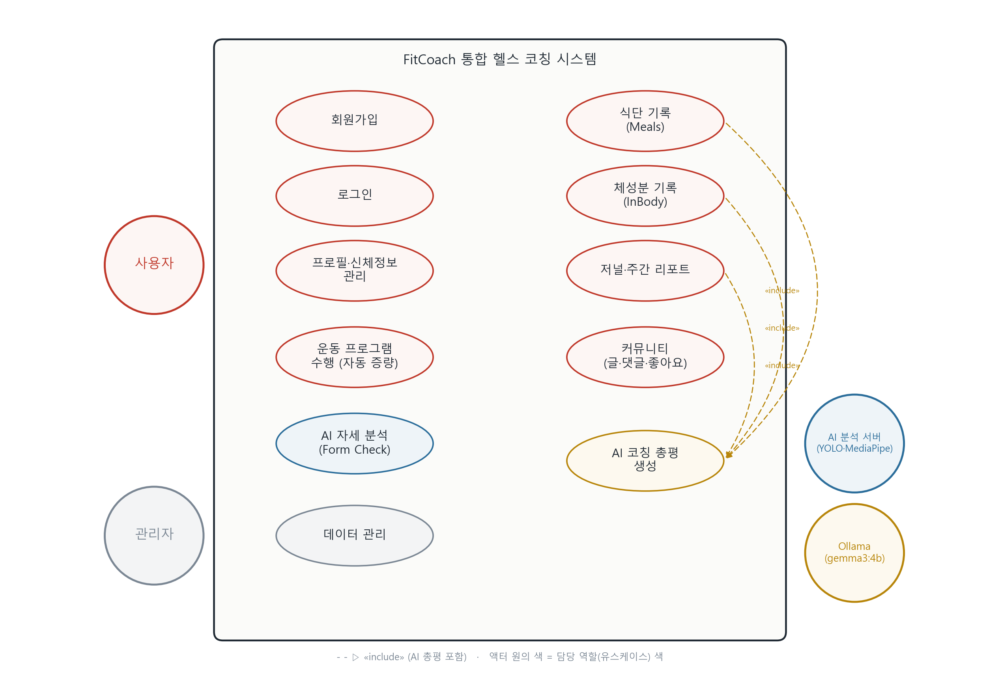

# Ⅱ. 유스케이스

## 1. 유스케이스 다이어그램

> 액터: **사용자**(주), **관리자**, **AI 분석 서버(YOLO·MediaPipe)**, **Ollama(gemma3:4b)**
> 점선 «include» : 식단·체성분·저널 기록 시 **AI 코칭 총평 생성(UC_AI_001)** 을 포함한다.

---

## 2. 유스케이스 명세

기능을 11개 유스케이스로 크게 구분하고, 기능마다 명세를 작성한다.
해당 항목에 조건이 없으면 **N/A** 로 표기한다.

### ID 명명 규칙 (변수명 형식)
- **유스케이스 ID** : `UC_<도메인>_<일련번호>` (예: `UC_AUTH_001`)
- **요구사항 ID** : `FR_<도메인>_<일련번호>` (예: `FR_AUTH_001`) — 상세 정의는 **Ⅲ. 기능 요구사항** 참조
- **도메인 코드** : AUTH(인증), USER(프로필), PROG(프로그램), FORM(폼체크), MEAL(식단), BODY(체성분), JRNL(저널), COMM(커뮤니티), AI(코칭총평), ADMIN(관리자)

| 유스케이스 ID | 유스케이스 이름 | 주 액터 |
|---|---|---|
| UC_AUTH_001 | 회원가입 | 사용자 |
| UC_AUTH_002 | 로그인 / 로그아웃 | 사용자 |
| UC_USER_001 | 프로필·신체정보 관리 | 사용자 |
| UC_PROG_001 | 운동 프로그램 수행(자동 증량) | 사용자 |
| UC_FORM_001 | AI 자세 분석(Form Check) | 사용자 |
| UC_MEAL_001 | 식단 기록(Meals) | 사용자 |
| UC_BODY_001 | 체성분 기록(InBody) | 사용자 |
| UC_JRNL_001 | 저널·주간 리포트 | 사용자 |
| UC_COMM_001 | 커뮤니티(글·댓글·좋아요) | 사용자 |
| UC_AI_001 | AI 코칭 총평 생성 | Ollama |
| UC_ADMIN_001 | 데이터 관리 | 관리자 |

---

#### UC_AUTH_001

| 항목 | 내용 |
|---|---|
| 유스케이스 이름 | 회원가입 |
| 유스케이스 ID | UC_AUTH_001 |
| 관련 요구사항 | FR_AUTH_001, FR_AUTH_002, FR_AUTH_003 |
| 우선순위 | 상 |
| 선행조건 | 비로그인 상태에서 [회원가입] 버튼 클릭 |
| 관련 액터 | 사용자 |
| 이벤트 흐름 | ① 회원가입 화면 진입 → ② 아이디·비밀번호·닉네임(선택) 입력 → ③ 성별·나이·키·몸무게 입력 → ④ 생활습관·운동경력·운동빈도·체력수준·목표 선택 → ⑤ [가입] 클릭 → ⑥ 서버가 아이디 중복 검사 → ⑦ 비밀번호 bcrypt 해시 후 회원 생성 |
| 종료조건 | 가입 완료 메시지 표시 후 로그인 화면으로 이동 |
| 사후조건 | users 테이블에 신규 회원 레코드 생성(비밀번호는 해시로 저장) |
| 기타 요구사항 | 아이디는 유일해야 함. 입력한 신체정보는 BMR·TDEE 계산 기준으로 사용 |

---

#### UC_AUTH_002

| 항목 | 내용 |
|---|---|
| 유스케이스 이름 | 로그인 / 로그아웃 |
| 유스케이스 ID | UC_AUTH_002 |
| 관련 요구사항 | FR_AUTH_004, FR_AUTH_005 |
| 우선순위 | 상 |
| 선행조건 | 가입된 계정이 존재, 로그인 화면에서 아이디·비밀번호 입력 후 [로그인] 클릭 |
| 관련 액터 | 사용자 |
| 이벤트 흐름 | ① 아이디·비밀번호 입력 → ② [로그인] 클릭 → ③ 서버가 해시 비교로 인증 → ④ JWT access token 발급 → ⑤ 토큰을 localStorage 저장 → ⑥ 저널(/journal) 화면으로 이동 / [로그아웃] 클릭 시 ⑦ 토큰 삭제 → ⑧ Landing 화면으로 전환 |
| 종료조건 | 로그인 성공 시 메인(저널) 진입 / 로그아웃 시 Landing 화면 표시 |
| 사후조건 | 로그인: 클라이언트에 인증 토큰 보유 → 보호 기능 접근 가능 / 로그아웃: 토큰 제거 |
| 기타 요구사항 | 인증 실패 시 오류 메시지 표시. 토큰 만료 시 재로그인 필요 |

---

#### UC_USER_001

| 항목 | 내용 |
|---|---|
| 유스케이스 이름 | 프로필·신체정보 관리 |
| 유스케이스 ID | UC_USER_001 |
| 관련 요구사항 | FR_USER_001, FR_USER_002, FR_USER_003 |
| 우선순위 | 중 |
| 선행조건 | 로그인 상태에서 설정/프로필 화면 진입 |
| 관련 액터 | 사용자 |
| 이벤트 흐름 | ① 프로필 화면 진입 → ② 닉네임·아바타 선택 → ③ 키·몸무게·목표 등 수정 → ④ [저장] 클릭 → ⑤ BMR·TDEE 자동 재계산 및 표시 |
| 종료조건 | 저장 완료 후 변경값이 화면에 반영 |
| 사후조건 | users 테이블의 프로필·신체정보 갱신, BMR·TDEE 재계산 |
| 기타 요구사항 | 닉네임 미설정 시 커뮤니티에서 username 앞 2글자 마스킹으로 노출 |

---

#### UC_PROG_001

| 항목 | 내용 |
|---|---|
| 유스케이스 이름 | 운동 프로그램 수행(자동 증량) |
| 유스케이스 ID | UC_PROG_001 |
| 관련 요구사항 | FR_PROG_001, FR_PROG_002, FR_PROG_003, FR_PROG_004 |
| 우선순위 | 상 |
| 선행조건 | 로그인 후 프로그램 선택, 시작 중량 입력, [세션 시작] 클릭 |
| 관련 액터 | 사용자 |
| 이벤트 흐름 | ① 프로그램 선택(StrongLifts·nSuns·5/3/1 등 10종) → ② 시작 중량 입력 → ③ 세션 시작 → ④ 종목별 세트·반복 수행 체크 → ⑤ 성공/실패 판정 → ⑥ 성공 시 다음 세션 중량 자동 증량 계산 → ⑦ 세션 요약 저장 (별도로 1RM 계산기 단독 사용 가능) |
| 종료조건 | 세션 종료 후 운동 요약(WorkoutSummary) 화면 표시 |
| 사후조건 | routine_logs(세션 기록) 저장, 사용자 루틴 진행 상태(1RM·단계·중량) 갱신 |
| 기타 요구사항 | 증량 폭·디로드 규칙은 프로그램별 엔진(programs.js)에 따름. 1RM은 Epley 공식 사용 |

---

#### UC_FORM_001

| 항목 | 내용 |
|---|---|
| 유스케이스 이름 | AI 자세 분석(Form Check) |
| 유스케이스 ID | UC_FORM_001 |
| 관련 요구사항 | FR_FORM_001, FR_FORM_002, FR_FORM_003, FR_FORM_004 |
| 우선순위 | 상 |
| 선행조건 | 로그인, 운동 종목 선택 후 영상 업로드/촬영, AI 분석 사이드카(8003) 가동 |
| 관련 액터 | 사용자, AI 분석 서버(YOLO·MediaPipe) |
| 이벤트 흐름 | ① 운동 종목 선택 → ② 영상 업로드 또는 가이드 촬영 → ③ 백엔드가 사이드카로 분석 위임 → ④ YOLO 크롭 + MediaPipe 포즈 추정 → ⑤ 점수 로직으로 5축(안정성·가동범위·동작품질·자세·코어) 점수 산출 → ⑥ 진단 리포트 표시 → ⑦ 결과를 회원 계정에 저장 |
| 종료조건 | 5축 진단 리포트 출력 |
| 사후조건 | formcheck_logs에 분석 결과 저장 → 저널 일별 entry에 노출 |
| 기타 요구사항 | 첫 실행 시 YOLOv5 모델 다운로드(인터넷 필요). 3대 운동은 학습 RF 모델(.pkl), 추가 15종은 관절 각도 규칙+점수 로직 판정. 핵심 파이프라인은 PSLeon24 IEEE Access 2024 연구 기반 |

---

#### UC_MEAL_001

| 항목 | 내용 |
|---|---|
| 유스케이스 이름 | 식단 기록(Meals) |
| 유스케이스 ID | UC_MEAL_001 |
| 관련 요구사항 | FR_MEAL_001, FR_MEAL_002, FR_MEAL_003, FR_MEAL_004 |
| 우선순위 | 상 |
| 선행조건 | 로그인 후 식단 화면에서 끼니 선택, [음식 추가] 클릭 |
| 관련 액터 | 사용자, Ollama(AI 총평) |
| 이벤트 흐름 | ① 끼니 선택(아침·점심·저녁·간식) → ② 음식 검색/사진/즐겨찾기 선택 → ③ 섭취량·매크로(칼로리·탄수·단백·지방) 입력 → ④ [저장] 클릭 → ⑤ 목표 매크로 대비 진척 표시 → ⑥ (요청 시) AI 총평 생성 «include UC_AI_001» |
| 종료조건 | 저장 후 식단 목록·합계가 갱신되어 표시 |
| 사후조건 | diet_logs 저장, 일/주 영양소 합계 갱신 |
| 기타 요구사항 | 영양소는 100g당 값으로 저장하며 실섭취량 = 값 × (섭취중량/100). 즐겨찾기 재사용 지원 |

---

#### UC_BODY_001

| 항목 | 내용 |
|---|---|
| 유스케이스 이름 | 체성분 기록(InBody) |
| 유스케이스 ID | UC_BODY_001 |
| 관련 요구사항 | FR_BODY_001, FR_BODY_002, FR_BODY_003 |
| 우선순위 | 상 |
| 선행조건 | 로그인 후 체성분 화면에서 [기록 추가] 클릭 |
| 관련 액터 | 사용자, Ollama(AI 코멘트) |
| 이벤트 흐름 | ① 측정일·체중(필수) 입력 → ② 골격근량·체지방량·체지방률·기초대사량 입력(선택) → ③ [저장] 클릭 → ④ 추이 그래프 갱신 → ⑤ 직전 측정과 비교한 AI 코멘트 생성(첫 측정이면 baseline 평가) «include UC_AI_001» |
| 종료조건 | 저장 후 추이 그래프와 AI 코멘트가 화면에 표시 |
| 사후조건 | inbody_logs 저장, ai_comment 캐시 |
| 기타 요구사항 | 체중만 필수, 나머지 선택. Ollama 미연결 시 코멘트는 생략하되 기록은 정상 저장. 코멘트 재생성 가능 |

---

#### UC_JRNL_001

| 항목 | 내용 |
|---|---|
| 유스케이스 이름 | 저널·주간 리포트 |
| 유스케이스 ID | UC_JRNL_001 |
| 관련 요구사항 | FR_JRNL_001, FR_JRNL_002, FR_JRNL_003 |
| 우선순위 | 중 |
| 선행조건 | 로그인 후 저널 화면에서 달력의 날짜 선택 |
| 관련 액터 | 사용자, Ollama(AI 총평) |
| 이벤트 흐름 | ① 달력에서 날짜 선택 → ② 그 날의 운동·식단·체성분 entry 표시 → ③ 메모 작성/저장 → ④ 주간 리포트 조회 → ⑤ 일/주 AI 총평 생성 «include UC_AI_001» |
| 종료조건 | 메모 저장 또는 리포트 조회 후 화면에 반영 |
| 사후조건 | journal_entries 저장(메모·AI 총평), 하루(user_id+날짜)당 1건 upsert |
| 기타 요구사항 | 저널 화면의 [재생성] 버튼으로 AI 총평 수동 재생성 가능 |

---

#### UC_COMM_001

| 항목 | 내용 |
|---|---|
| 유스케이스 이름 | 커뮤니티(글·댓글·좋아요) |
| 유스케이스 ID | UC_COMM_001 |
| 관련 요구사항 | FR_COMM_001, FR_COMM_002, FR_COMM_003 |
| 우선순위 | 중 |
| 선행조건 | 로그인 후 커뮤니티 화면에서 [글쓰기] 클릭 |
| 관련 액터 | 사용자 |
| 이벤트 흐름 | ① 글 작성(메시지·위치·벤치/데드/스쿼트 1RM) → ② 목록(최신순) 노출 → ③ 댓글/비밀댓글 작성 → ④ 좋아요 토글 → ⑤ 본인 글·댓글 수정/삭제 |
| 종료조건 | 등록/수정/삭제 후 목록과 좋아요·댓글 수 갱신 |
| 사후조건 | community_posts / comments / likes 저장, 카운트 갱신 |
| 기타 요구사항 | 닉네임은 설정값 또는 username 앞 2글자 마스킹으로 노출. 비밀댓글은 작성자·대상만 열람 |

---

#### UC_AI_001  «included»

| 항목 | 내용 |
|---|---|
| 유스케이스 이름 | AI 코칭 총평 생성 |
| 유스케이스 ID | UC_AI_001 |
| 관련 요구사항 | FR_AI_001, FR_AI_002, FR_AI_003 |
| 우선순위 | 중 |
| 선행조건 | UC_MEAL_001 / UC_BODY_001 / UC_JRNL_001에서 기록 저장 시 자동 호출되거나 [재생성] 클릭, 로컬 Ollama(11434) 가동 및 gemma3:4b 모델 보유 |
| 관련 액터 | Ollama(주), 사용자(부) |
| 이벤트 흐름 | ① 호출자(식단/체성분/저널)가 데이터 전달 → ② 프롬프트 조립 → ③ Ollama 호출 → ④ 응답 후처리(이모지·마크다운 제거) → ⑤ 결과 저장 후 반환 |
| 종료조건 | 생성된 코멘트 반환 및 화면 표시 |
| 사후조건 | 생성 코멘트를 해당 엔티티(diet/inbody/journal)에 저장·캐시 |
| 기타 요구사항 | 2~3문장·100자 이내, 의학 진단·약 추천 금지. Ollama 미연결/타임아웃 시 None 반환(기능 중단 없이 다음 트리거에서 재시도), 첫 호출은 모델 로딩으로 지연 가능 |

---

#### UC_ADMIN_001

| 항목 | 내용 |
|---|---|
| 유스케이스 이름 | 데이터 관리 |
| 유스케이스 ID | UC_ADMIN_001 |
| 관련 요구사항 | FR_ADMIN_001 |
| 우선순위 | 하 |
| 선행조건 | 관리자 권한으로 /admin 페이지 접속 |
| 관련 액터 | 관리자 |
| 이벤트 흐름 | ① /admin 접속 → ② 회원/식단/운동 기록 목록 조회 → ③ 레코드 상세 확인 → ④ 필요 시 수정·삭제 |
| 종료조건 | 조회/수정/삭제 작업 후 관리 페이지에 반영 |
| 사후조건 | N/A |
| 기타 요구사항 | N/A |

---

# Ⅲ. 기능 요구사항

유스케이스의 "관련 요구사항"에 지정한 ID마다 어떤 기능을 수행하는지 정의한다.

| ID | 요구사항명칭 | 설명 | 우선순위 |
|---|---|---|---|
| FR_AUTH_001 | 아이디 중복 검사 | 동일 아이디(username)가 존재하면 가입을 막음 | 상 |
| FR_AUTH_002 | 회원정보 입력·저장 | 신체정보·운동성향·목표를 입력받아 회원으로 저장함 | 상 |
| FR_AUTH_003 | 비밀번호 암호화 | 비밀번호를 bcrypt로 해시하여 저장함 | 상 |
| FR_AUTH_004 | 로그인 인증 | 사용자를 인증하고 JWT 토큰을 발급함 | 상 |
| FR_AUTH_005 | 로그아웃 | 저장된 인증 토큰을 폐기함 | 중 |
| FR_USER_001 | 프로필 설정 | 닉네임·아바타를 설정/수정하게 함 | 중 |
| FR_USER_002 | 신체정보 수정 | 키·몸무게·목표 등 신체정보를 수정하게 함 | 중 |
| FR_USER_003 | 에너지량 계산 | 신체정보로 BMR·TDEE를 자동 계산함 | 중 |
| FR_PROG_001 | 프로그램 선택 | 10종 프로그램을 선택하고 시작 중량을 입력하게 함 | 상 |
| FR_PROG_002 | 세션 기록 | 세션 수행 결과를 기록·저장함(routine_logs) | 상 |
| FR_PROG_003 | 자동 증량 | 성공 판정 시 다음 세션 중량을 자동으로 올림 | 상 |
| FR_PROG_004 | 1RM 계산 | Epley 공식으로 1RM을 계산함 | 중 |
| FR_FORM_001 | 영상 입력 | 운동 영상을 업로드하거나 가이드 촬영하게 함 | 상 |
| FR_FORM_002 | 포즈 추정 | YOLO 크롭 + MediaPipe로 자세(포즈)를 추정함 | 상 |
| FR_FORM_003 | 자세 진단 | 5축 점수 기반 자세 진단 리포트를 생성함 | 상 |
| FR_FORM_004 | 분석 결과 저장 | 분석 결과를 저장하고 저널에 연동함(formcheck_logs) | 중 |
| FR_MEAL_001 | 음식 선택 | 끼니별로 음식을 검색·사진·즐겨찾기로 선택하게 함 | 상 |
| FR_MEAL_002 | 매크로 기록 | 칼로리·탄수·단백·지방을 입력·저장함 | 상 |
| FR_MEAL_003 | 진척 표시 | 목표 매크로 대비 진척을 표시함 | 중 |
| FR_MEAL_004 | 식단 총평 | 식단 데이터로 AI 총평을 요청함(→ FR_AI_002) | 중 |
| FR_BODY_001 | 체성분 기록 | 체성분 측정값을 입력·저장함(체중 필수) | 상 |
| FR_BODY_002 | 추이 그래프 | 측정 추이를 그래프로 표시함 | 중 |
| FR_BODY_003 | 체성분 코멘트 | 직전 측정과 비교한 AI 코멘트를 요청함(→ FR_AI_002) | 중 |
| FR_JRNL_001 | 일별 조회 | 달력에서 날짜별 운동·식단·체성분 기록을 조회함 | 중 |
| FR_JRNL_002 | 메모 작성 | 일별 메모를 작성·저장함(upsert) | 중 |
| FR_JRNL_003 | 주간 리포트 | 주간 리포트와 AI 총평을 생성함(→ FR_AI_002) | 중 |
| FR_COMM_001 | 게시글 관리 | 글을 작성/수정/삭제함(1RM·위치 포함) | 중 |
| FR_COMM_002 | 댓글 | 댓글·비밀댓글을 작성함(작성자·대상만 열람) | 중 |
| FR_COMM_003 | 좋아요 | 좋아요를 토글하고 카운트를 갱신함 | 하 |
| FR_AI_001 | 프롬프트 조립 | 운동·식단·체성분 데이터로 프롬프트를 구성함 | 중 |
| FR_AI_002 | LLM 호출 | Ollama(gemma3:4b)를 호출하고 응답을 후처리함 | 중 |
| FR_AI_003 | 코멘트 저장 | 생성 코멘트를 저장/캐시하고 재생성하게 함 | 하 |
| FR_ADMIN_001 | 데이터 관리 | 회원/식단/운동 기록을 조회·수정·삭제함(sqladmin) | 하 |
